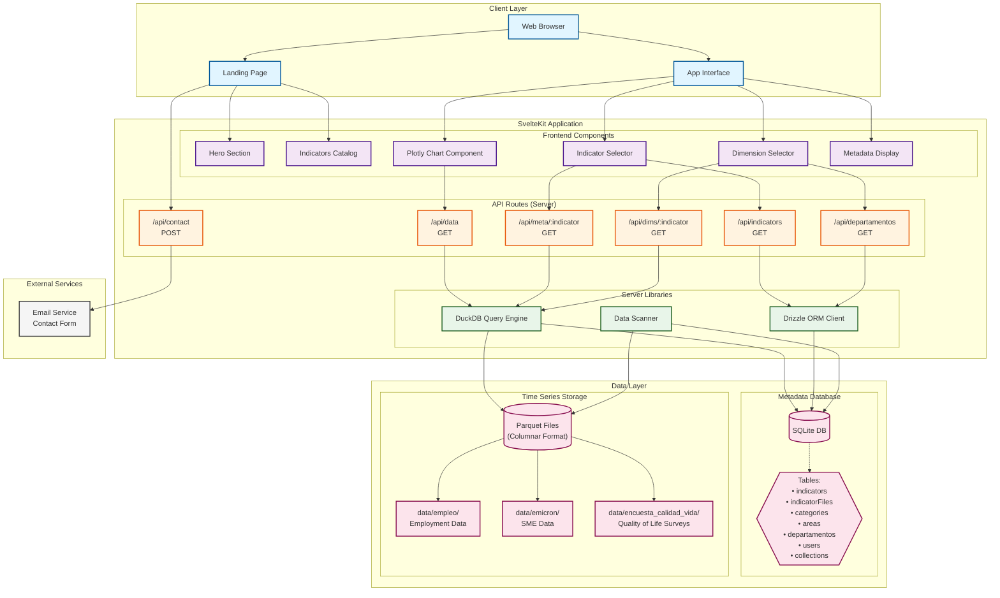
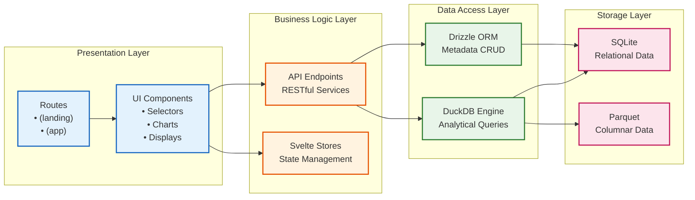
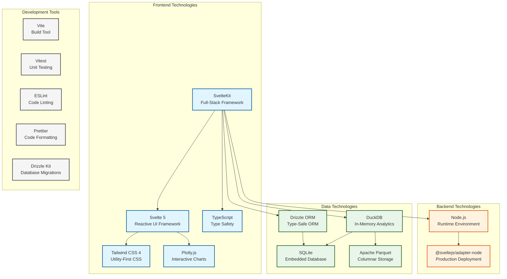
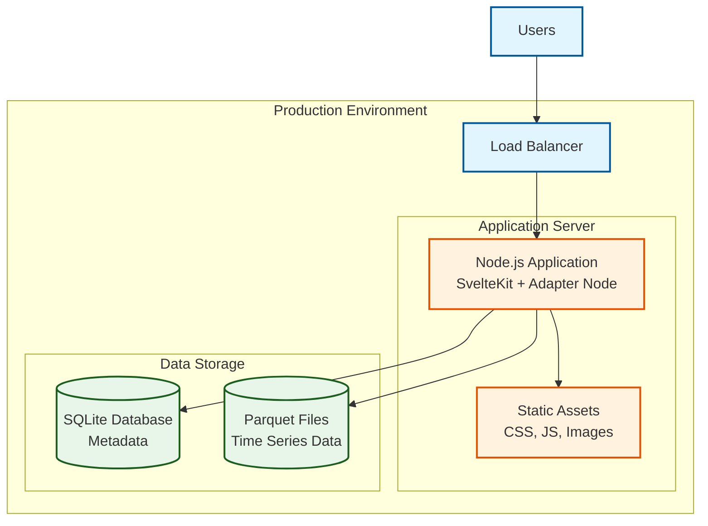

# High-Level Architecture

This document provides a high-level overview of the Colombia en Datos web application architecture.

## System Architecture Diagram



## Component Layer Architecture



## Technology Stack



## Data Flow Architecture

```mermaid
flowchart TD
    Start([User Visits Site]) --> Landing{Landing or App?}

    Landing -->|Landing Page| LandingFlow[Show Hero & Catalog]
    Landing -->|App Page| AppFlow[Show Dashboard]

    AppFlow --> SelectIndicators[Select Indicators & Filters]
    SelectIndicators --> ParallelCalls{Parallel API Calls}

    ParallelCalls -->|Metadata| MetaFlow[/api/meta/:indicator]
    ParallelCalls -->|Data| DataFlow[/api/data]

    MetaFlow --> QueryMeta[Query SQLite + Parquet Schema]
    DataFlow --> QueryData[Query SQLite for Files]

    QueryMeta --> ReturnMeta[Return Dimensions & Units]
    QueryData --> FilterFiles[Filter by Year & Area]
    FilterFiles --> DuckDBQuery[Execute DuckDB Queries]
    DuckDBQuery --> ReadParquet[Read Parquet Files]
    ReadParquet --> AggregateData[Aggregate & Sort Results]
    AggregateData --> ReturnData[Return Time Series Data]

    ReturnMeta --> Transform[Transform to Plotly Format]
    ReturnData --> Transform

    Transform --> RenderChart[Render Interactive Chart]
    RenderChart --> UserInteraction[User Modifies Filters]
    UserInteraction --> SelectIndicators

    LandingFlow --> ContactForm{Contact Form?}
    ContactForm -->|Yes| SendEmail[POST /api/contact]
    ContactForm -->|No| Browse[Browse Catalog]
    Browse --> AppFlow

    classDef userAction fill:#e1f5ff,stroke:#01579b,stroke-width:2px
    classDef apiCall fill:#fff3e0,stroke:#e65100,stroke-width:2px
    classDef dataOp fill:#e8f5e9,stroke:#1b5e20,stroke-width:2px
    classDef rendering fill:#f3e5f5,stroke:#4a148c,stroke-width:2px

    class Start,SelectIndicators,UserInteraction,ContactForm,Browse userAction
    class MetaFlow,DataFlow,SendEmail apiCall
    class QueryMeta,QueryData,FilterFiles,DuckDBQuery,ReadParquet,AggregateData dataOp
    class RenderChart,Transform,LandingFlow,AppFlow rendering
```

## Key Architectural Patterns

### 1. **Full-Stack Framework Pattern**

- SvelteKit provides both client-side interactivity and server-side rendering
- File-based routing for pages and API endpoints
- Server-side code runs in Node.js environment

### 2. **Hybrid Data Storage Pattern**

- **SQLite**: Lightweight relational database for metadata, relationships, and reference data
- **Parquet**: Columnar storage for large-scale time series data
- **DuckDB**: In-memory analytical engine that bridges both storage systems

### 3. **API-First Architecture**

- RESTful API endpoints for all data operations
- Clear separation between UI and data layer
- Enables future mobile app or external integrations

### 4. **Component-Based UI**

- Reusable Svelte components for common UI patterns
- Reactive state management with Svelte's built-in stores
- TypeScript for type safety across components

### 5. **Progressive Enhancement**

- Landing page with static content loads fast
- App interface progressively loads data as needed
- Interactive charts rendered client-side with Plotly

### 6. **Performance Optimization**

- Parallel API calls for metadata and data
- Year-based file filtering to reduce query scope
- In-memory DuckDB for fast analytical queries
- Columnar parquet format for efficient data scanning

## Deployment Architecture



## Directory Structure

```
frontend/
├── src/
│   ├── lib/
│   │   ├── components/          # Reusable UI components
│   │   ├── db/                  # Database schemas and clients
│   │   ├── landing/             # Landing page components
│   │   ├── server/              # Server-side logic (DuckDB, etc.)
│   │   └── stores/              # Svelte stores
│   ├── routes/
│   │   ├── (landing)/           # Landing page route group
│   │   ├── (app)/               # Application route group
│   │   └── api/                 # API endpoints
│   └── app.html                 # HTML template
├── data/                        # Parquet files organized by dataset
│   ├── empleo/
│   ├── emicron/
│   └── encuesta_calidad_vida/
├── drizzle/                     # Database migrations and SQLite DB
├── scripts/                     # Seed and utility scripts
├── static/                      # Static assets
└── docs/                        # Documentation
```

## Key Features

1. **Data Visualization Platform**: Interactive time series charts for Colombian economic indicators
2. **Multi-Dataset Support**: Employment, SME, and Quality of Life data
3. **Advanced Filtering**: By department, time period, demographics, and custom dimensions
4. **Metadata Management**: Rich indicator metadata with units, sources, and descriptions
5. **Responsive Design**: Works on desktop and mobile devices
6. **Type-Safe Development**: Full TypeScript coverage for reliability
7. **Performance Optimized**: Fast queries with DuckDB and efficient parquet storage

## Scalability Considerations

- **Horizontal Scaling**: Stateless Node.js app can be replicated
- **Database Scaling**: SQLite is embedded; consider PostgreSQL for multi-instance deployments
- **Data Growth**: Parquet files are partitioned by year and area for efficient querying
- **Caching**: Browser caching for static assets, potential for Redis caching layer
- **CDN Integration**: Static assets can be served via CDN for global performance
