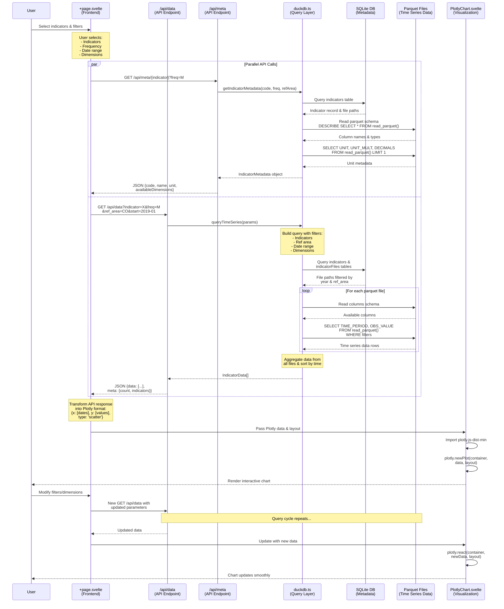

# Data Flow Sequence Diagram

This diagram illustrates the complete data flow from the main indicator visualization page through the API layer to DuckDB for querying parquet files, and back to the frontend for visualization.

## Sequence Diagram

## Component Overview

### 1. Frontend (`+page.svelte`)

- **Location**: `src/routes/(app)/app/+page.svelte`
- **Responsibilities**:
  - Manages user selections (indicators, filters, dimensions)
  - Makes parallel API calls for metadata and data
  - Transforms API responses into Plotly chart format
  - Updates chart when filters change

### 2. Data API Endpoint

- **Location**: `src/routes/api/data/+server.ts`
- **Responsibilities**:
  - Receives query parameters (indicators, ref_area, frequency, date range, dimensions)
  - Delegates to DuckDB query layer
  - Returns formatted JSON response with data and metadata

### 3. Metadata API Endpoint

- **Location**: `src/routes/api/meta/[indicator]/+server.ts`
- **Responsibilities**:
  - Retrieves indicator metadata
  - Returns available dimensions and unit information

### 4. DuckDB Query Layer

- **Location**: `src/lib/server/duckdb.ts`
- **Key Functions**:
  - `queryTimeSeries()`: Main data query function
  - `getIndicatorMetadata()`: Retrieves indicator metadata and available dimensions
  - `getParquetColumns()`: Reads parquet file schema
- **Responsibilities**:
  - Queries SQLite for indicator metadata and file paths
  - Filters parquet files by year and reference area
  - Executes SQL queries on parquet files using DuckDB
  - Applies dimension filters and date ranges
  - Aggregates and sorts results from multiple files

### 5. Data Storage

#### SQLite Database

- **Location**: `drizzle/db.sqlite`
- **Schema**: `src/lib/db/schema/`
- **Tables**:
  - `indicators`: Indicator definitions (code, name, description, source)
  - `indicatorFiles`: Maps indicators to parquet file paths with year and ref_area
  - `categories` & `areas`: Organizational hierarchy

#### Parquet Files

- **Location**: `data/` directory (organized by dataset)
- **Format**: SDMX-based columns
  - `TIME_PERIOD`: Date/time value
  - `OBS_VALUE`: Numeric observation
  - `REF_AREA`: Geographic reference (e.g., 'CO' for Colombia)
  - `FREQ`: Frequency (M=Monthly, A=Annual)
  - Dimension columns: `URBAN_RURAL`, `SEX`, `AGE`, `DEPT_CODE`, etc.

### 6. Visualization (`PlotlyChart.svelte`)

- **Location**: `src/lib/components/PlotlyChart.svelte`
- **Responsibilities**:
  - Dynamically imports Plotly.js
  - Renders interactive charts using Plotly
  - Updates charts reactively when data changes

## Data Flow Steps

1. **User Interaction**: User selects indicators and applies filters
2. **Parallel API Calls**: Frontend makes simultaneous requests for metadata and data
3. **Metadata Retrieval**:
   - Query SQLite for indicator info
   - Read parquet schema for available dimensions
   - Return unit information
4. **Data Query**:
   - Query SQLite for relevant parquet file paths
   - Filter files by year and reference area
   - For each file:
     - Read schema to validate dimension columns
     - Execute SQL query with WHERE clauses
     - Collect time series data
   - Aggregate and sort all results
5. **Response Formation**: Format data as JSON with metadata
6. **Data Transformation**: Convert to Plotly format
7. **Visualization**: Render interactive chart
8. **Updates**: When filters change, repeat steps 4-7

## Performance Optimizations

- **Parallel API Calls**: Metadata and data fetched simultaneously
- **File Filtering**: Only query parquet files within date range
- **Column Detection**: Dynamic dimension filtering based on available columns
- **In-Memory DuckDB**: Fast analytical queries on parquet files
- **Reactive Updates**: Plotly's `react()` method for smooth chart updates
